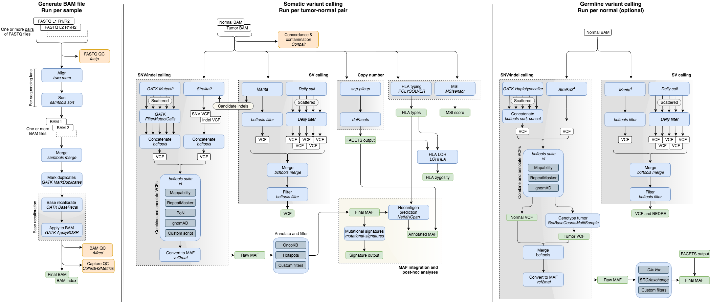
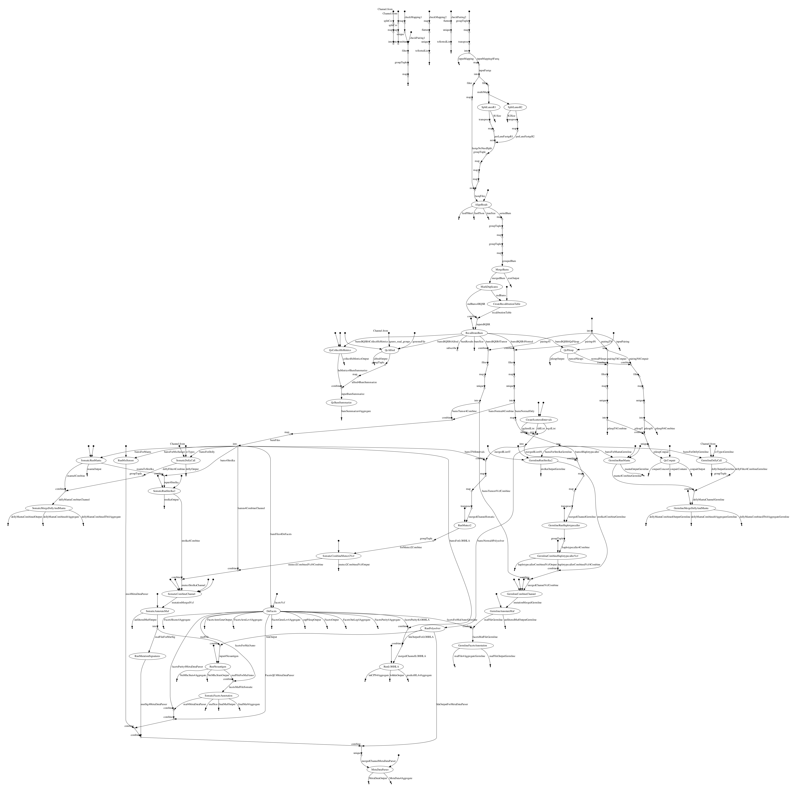

## Introduction

# Time-Efficient Mutational Profiling in Oncology (Tempo)

Tempo is a computational pipeline for processing data of paired-end whole-exome (WES) and whole-genome sequencing (WGS) of human cancer samples with matched normals. Its components are containerized and the pipeline runs on the [Juno high-performance computing cluster](http://mskcchpc.org/display/CLUS/Juno+Cluster+Guide) at Memorial Sloan Kettering Cancer Center and on [Amazon Web Services (AWS)](https://aws.amazon.com). The pipeline was written by members of the [Center for Molecular Oncology](https://www.mskcc.org/research-programs/molecular-oncology).

The pipeline is built using [Nextflow](https://www.nextflow.io), a workflow tool to run tasks across multiple compute infrastructures in a very portable manner. It uses Docker/Singularity containers making installation trivial and results highly reproducible. The [Nextflow DSL2](https://www.nextflow.io/docs/latest/dsl2.html) implementation of this pipeline uses one container per process which makes it much easier to maintain and update software dependencies. Where possible, these processes have been submitted to and installed from [nf-core/modules](https://github.com/nf-core/modules) in order to make them available to all nf-core pipelines, and to everyone within the Nextflow community!

These pages contain instructions on how to run the Tempo pipeline. It also contains documentation on the bioinformatic components in the pipeline, some motivation for various parameter choices, plus an outline describing the reference resources used. 

If there are any questions or comments, you are welcome to [raise an issue](https://github.com/mskcc/tempo/issues/new?title=[User%20question]).

<small>Note: Tempo currently only supports human samples. The pipeline has only been tested for exome and genome sequencing experiments, and all reference files are in build GRCh37 of the human genome.</small>

On release, automated continuous integration tests run the pipeline on a full-sized dataset on the AWS cloud infrastructure. This ensures that the pipeline runs on AWS, has sensible resource allocation defaults set to run on real-world datasets, and permits the persistent storage of results to benchmark between pipeline releases and other analysis sources.

---

## Table of Contents

### 1. Getting Started

#### 1.1. Setup
* [Installation](docs/installation.md)
* [Setup on Juno](docs/juno-setup.md)
* [Setup on AWS](docs/aws-setup.md)

#### 1.2. Usage
* [Running the Pipeline](docs/running-the-pipeline.md)
    * [Overview](docs/running-the-pipeline.md#overview)
    * [Input Files](docs/running-the-pipeline.md#input-files)
    * [Execution Mode](docs/running-the-pipeline.md#execution-mode)
    * [Modifying or Resuming Pipeline Run](docs/running-the-pipeline.md#modifying-or-resuming-pipeline-run)
    * [After Successful Run](docs/running-the-pipeline.md#after-successful-run)
* [Nextflow Basics](docs/nextflow-basics.md)
* [Working With Containers](docs/working-with-containers.md)

#### 1.3 Outputs
* [BAM Files](docs/outputs.md#bam-files)
* [QC Outputs](docs/outputs.md#qc-outputs)
* [Somatic Data](docs/outputs.md#somatic-data)
* [Germline Data](docs/outputs.md#germline-data)
* [Cohort Level Outputs](docs/outputs.md#cohort-level-outputs)

### 2. Pipeline contents

#### 2.1. Bioinformatic Components
* [Read Alignment](docs/bioinformatic-components.md#read-alignment)
* [Somatic Analyses](docs/bioinformatic-components.md#somatic-analyses)
* [Germline Analyses](docs/bioinformatic-components.md#germline-analyses)
* [Quality Control](docs/bioinformatic-components.md#quality-control)

#### 2.2. Reference Resources
* [Genome Assembly](docs/reference-files.md#genome-assembly)
* [Genomic Intervals](docs/reference-files.md#genomic-intervals)
* [RepeatMasker and Mappability Blacklist](docs/reference-files.md#repeatmasker-and-mappability-blacklist)
* [Preferred Transcript Isoforms](docs/reference-files.md#preferred-transcript-isoforms)
* [Hotspot Annotation](docs/reference-files.md#hotspot-annotation.md)
* [OncoKB Annotation](docs/reference-files.md#oncokb.md)
* [gnomAD](docs/gnomad.md)
* [Panel of Normals for Exomes](docs/wes-panel-of-normals.md)

#### 2.3. Variant Annotation and Filtering
* [Somatic SNVs and Indels](docs/variant-annotation-and-filtering.md#somatic-snvs-and-indels)
* [Germline SNVs and Indels](docs/variant-annotation-and-filtering.md#germline-snvs-and-indels)
* [Somatic and Germline SVs](docs/variant-annotation-and-filtering.md#somatic-and-germline-svs)

### 3. Help and Other Resources
* [Troubleshooting](docs/troubleshooting.md)
* [AWS Glossary](docs/aws-glossary.md)

### 4. Contributing
* [Contributing to Tempo](docs/contributing-to-tempo.md)

### 5. Acknowledgements
* [Acknowledgements](docs/acknowledgements.md)

## Pipeline Flowchart

  

## Directed Acyclic Graph

  

##

  

---
