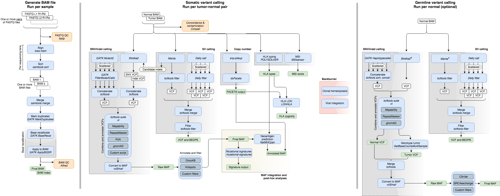

# Bioinformatic Components

The three main functions of the pipeline are:
1. Read alignment
2. Somatic variant detection
3. Germline variant detection

Additionally, various QC metrics are generated. Below are described the separate modules tools used. The following diagram outlines the workflow:

<small>Note: The pipeline can be run with already-aligned BAM files as input, which avoids the first of these three modules.</small>

## Read Alignment

Tempo accepts as input sequencing reads from one or multiple FASTQ file pairs (corresponding to separate sequencing lanes) per sample, as [described](running-the-pipeline.md#the-mapping-file). These are aligned against the human genome reference using common practices, which include:
* __Alignment__ using [BWA mem](http://bio-bwa.sourceforge.net/), followed by conversion to BAM file format and sorting using [samtools](https://samtools.github.io).
* __Merging__ of BAM files across sequencing lanes using [samtools](https://samtools.github.io).
* __PCR-duplicate marking__ using [GATK MarkDuplicates](https://software.broadinstitute.org/gatk).
* __Base-quality score recalibration__ with [GATK BaseRecalibrator and ApplyBQSR](https://software.broadinstitute.org/gatk/).

## Somatic Analyses

* __SNVs and indels__ are called using [MuTect2](https://software.broadinstitute.org/gatk/documentation/tooldocs/4.beta.4/org_broadinstitute_hellbender_tools_walkers_mutect_Mutect2.php) and [Strelka2](https://github.com/Illumina/strelka). Subsequently, they are combined, annotated and filtered as described [in the section on variant annotation and filtering](variant-annotation-and-filtering.md#somatic-snvs-and-indels).
* __Structural variants__ are detected by [Delly](https://github.com/dellytools/delly) and [Manta](https://github.com/Illumina/manta) then combined, filtered and annotated as described [in the section on variant annotation and filtering](variant-annotation-and-filtering.md#somatic-and-germline-svs). Merging and annotation is carried out using the [svtk](https://github.com/talkowski-lab/svtk) suite of tools.
* __Copy-number analysis__ is performed with [FACETS](https://github.com/mskcc/facets) and processed using [facets-suite](https://github.com/mskcc/facets-suite). Locus-specific copy-number, purity and ploidy estimates are integrated with the SNV/indel calls to perform clonality and zygosity analyses.
* __Microsatellite instability__ is detected using [MSIsensor](https://github.com/ding-lab/msisensor).
* __HLA genotyping__ is performed with [POLYSOLVER](https://software.broadinstitute.org/cancer/cga/polysolver).
* __LOH at HLA loci__ is assessed with [LOHHLA](https://github.com/mskcc/lohhla).
* __Mutational signatures__ are inferred with [https://github.com/mskcc/mutation-signatures](https://github.com/mskcc/mutation-signatures).
* __Neoantigen prediction__ using estimates of class I MHC binding affinity is performed with [NetMHC 4.0](https://www.ncbi.nlm.nih.gov/pubmed/28978689) and integrated into the set of SNV/indel calls using [https://github.com/taylor-lab/neoantigen-dev](https://github.com/taylor-lab/neoantigen-dev) (_Note: this repository is currently private_).

## Germline Analyses

* __SNVs and indels__ are called using [HaplotypeCaller](https://software.broadinstitute.org/gatk/documentation/tooldocs/4.0.8.0/org_broadinstitute_hellbender_tools_walkers_haplotypecaller_HaplotypeCaller.php) and [Strelka2](https://github.com/Illumina/strelka). Subsequently, they are combined, annotated and filtered as described [in the section on variant annotation and filtering](variant-annotation-and-filtering.md#germline-snvs-and-indels).
* __Structural variants__ are detected by [Delly](https://github.com/dellytools/delly) and [Manta](https://github.com/Illumina/manta) then combined, filtered and annotated as described [in the section on variant annotation and filtering](variant-annotation-and-filtering.md#somatic-and-germline-svs). Merging and annotation is carried out using the [svtk](https://github.com/talkowski-lab/svtk) suite of tools.

## Quality Control

* __FASTQ QC metrics__ are generated using [fastp](https://github.com/OpenGene/fastp).
* __BAM file QC metrics__ are generated using [Alfred](https://github.com/tobiasrausch/alfred).
* __Hybridisation-selection metrics__ are generated using [CollectHsMetrics](https://software.broadinstitute.org/gatk/documentation/tooldocs/4.beta.6/picard_analysis_directed_CollectHsMetrics.php). Only for exomes.
* __Contamination and concordance metrics__ for tumor-normal pairs using [Conpair](https://github.com/mskcc/Conpair).
